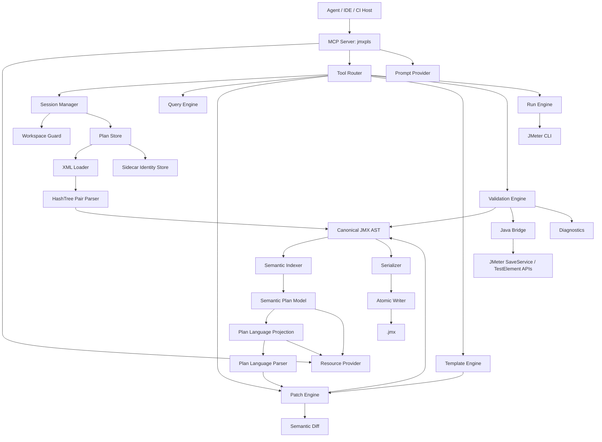

# jmxpls Design

**Project:** JMeter JMX MCP Server  
**Product name:** `jmxpls` — JMeter Plan Language Server over MCP  
**Document type:** Technical design  
**Target state:** Full-fidelity `.jmx` semantic editing with JMeter-backed correctness  
**Last updated:** 2026-06-28

---

## 1. Design thesis

The server shall not treat `.jmx` as plain XML. It shall treat `.jmx` as a serialized JMeter test-plan tree with three simultaneous representations:

| Representation | Purpose | Loss tolerance |
|---|---|---|
| Canonical JMX AST | Full-fidelity parse of XML, `hashTree`, element attributes, properties, and unknown/plugin content | Zero loss |
| Semantic Plan Model | Compact agent-facing tree and typed fields | Derived; rebuildable |
| Plan Language Projection | JSON/YAML document rendered from the semantic model for agent reading, review, and import/export | Derived; schema-valid; raw-linked only on request |
| JMeter Runtime Model | Loaded/saved/validated by JMeter APIs or CLI | Compatibility oracle |

The canonical AST is the preservation layer. The semantic model is the agent interface. The Plan Language projection is the portable agent-readable artifact. The JMeter runtime model is the correctness layer.

---

## 2. Architecture overview



---

## 3. Repository layout

```text
jmxpls/
  AGENTS.md
  README.md
  package.json
  pnpm-workspace.yaml
  tsconfig.base.json
  eslint.config.mjs
  vitest.config.ts

  packages/
    mcp-server/
      src/
        index.ts
        server.ts
        transports/
          stdio.ts
          http.ts
        resources/
          registry.ts
          plan-resources.ts
          catalog-resources.ts
          run-resources.ts
        tools/
          registry.ts
          session-tools.ts
          query-tools.ts
          plan-language-tools.ts
          mutation-tools.ts
          typed-component-tools.ts
          validation-tools.ts
          execution-tools.ts
          catalog-tools.ts
          template-tools.ts
        prompts/
          registry.ts
          plan-review.ts
          prepare-ci.ts
        security/
          workspace-guard.ts
          tool-policy.ts
          redaction.ts

    core/
      src/
        model/
          canonical.ts
          semantic.ts
          catalog.ts
          diagnostics.ts
          diff.ts
          patches.ts
          session.ts
        xml/
          load-xml.ts
          source-map.ts
          preserve.ts
          serialize-xml.ts
        jmx/
          hash-tree-parser.ts
          hash-tree-serializer.ts
          jmeter-path.ts
          property-tree.ts
          fingerprint.ts
        semantic/
          indexer.ts
          summarizer.ts
          execution-flow.ts
          variables.ts
        plan-language/
          model.ts
          projector.ts
          parser.ts
          serializer.ts
          redaction.ts
          roundtrip.ts
        patch/
          patch-engine.ts
          atomic-transaction.ts
          operations.ts
        validation/
          validator.ts
          xml-rules.ts
          hash-tree-rules.ts
          semantic-rules.ts
          component-rules.ts
          policy-rules.ts
          security-rules.ts
        components/
          registry.ts
          descriptors/
          adapters/
        templates/
          registry.ts
          http-api.ts
          login-flow.ts
          load-profiles.ts
        runs/
          jmeter-command.ts
          jtl-parser.ts
          report-generator.ts
        util/
          result.ts
          pagination.ts
          stable-json.ts

    java-bridge/
      build.gradle.kts
      settings.gradle.kts
      src/main/java/io/jmxpls/bridge/
        Main.java
        BridgeServer.java
        protocol/
          BridgeRequest.java
          BridgeResponse.java
        jmeter/
          JMeterBootstrap.java
          JmxLoadCommand.java
          JmxSaveCommand.java
          JmxValidateCommand.java
          ComponentCatalogCommand.java
          DefaultElementCommand.java
          RoundTripCommand.java
          RunPlanCommand.java
      src/test/java/io/jmxpls/bridge/

  schemas/
    canonical-jmx.schema.json
    semantic-plan.schema.json
    semantic-patch.schema.json
    jmxpls-plan-language.schema.json
    diagnostics.schema.json
    component-catalog.schema.json
    sidecar.schema.json
    tool-output.schema.json

  fixtures/
    jmx/
    plugins/
    malformed/
    large/

  examples/
    basic-http/
    login-token-flow/
    jdbc/
    ci/

  docs/
    architecture.md
    component-adapters.md
    plugin-support.md
    validation.md
    security.md
```

---

## 4. Technology selection

### 4.1 TypeScript MCP facade

Use TypeScript for the MCP server because:

- It gives strong schema tooling for MCP tool inputs and outputs.
- It is practical for agent-facing server development.
- It integrates well with JSON Schema, Zod, filesystem operations, streaming logs, and test tooling.

Production rule:

- Use the current production-stable MCP SDK version.
- If the SDK main branch is pre-release, pin the stable line and isolate MCP specifics behind a thin adapter.

### 4.2 Java bridge

Use Java for JMeter correctness because:

- JMeter itself is Java.
- JMeter APIs understand `TestElement`, `ListedHashTree`, properties, SaveService, and plugin classpaths.
- The bridge can load/save/validate in the same ecosystem that will execute the test.

Bridge mode:

- Default: long-lived stdio JSON command loop for performance.
- Fallback: one-shot process per command for easier debugging.

### 4.3 XML AST layer

Use a TypeScript XML parser that can preserve:

- Attribute order where possible.
- Element order.
- Text/CDATA/escaped values.
- Comments if supported.
- Empty elements.

Recommended implementation:

- Start with `saxes` or a similar event parser for precise source mapping.
- Use `xmlbuilder2` or a custom serializer for lossless/minimal-patch mode.
- Keep `fast-xml-parser` only if fidelity requirements are met through tests.

---

## 5. Core data model

### 5.1 Canonical document

```ts
export type JmxDocument = {
  documentId: string;
  source: {
    path?: string;
    encoding: string;
    lineEnding: "LF" | "CRLF";
    originalFingerprint: string;
  };
  xml: {
    declaration?: XmlDeclaration;
    root: JmxRoot;
    comments?: XmlComment[];
  };
  ast: CanonicalJmxTree;
  sidecar?: SidecarMetadata;
  catalog: ComponentCatalog;
  revisions: RevisionLog;
};
```

### 5.2 Canonical tree

```ts
export type CanonicalJmxTree = {
  rootHashTree: HashTreeNode;
  nodesById: Map<NodeId, JmxPairNode>;
  pathsById: Map<NodeId, JmxPath>;
};

export type HashTreeNode = {
  id: NodeId;
  kind: "hashTree";
  children: JmxPairNode[];
  raw?: RawXmlSlice;
  source?: SourceRange;
};

export type JmxPairNode = {
  id: NodeId;
  element: JmxElementNode;
  childTree: HashTreeNode;
  parentId?: NodeId;
  ordinal: number;
  fingerprint: string;
  semantic?: SemanticNodeRef;
};

export type JmxElementNode = {
  tagName: string;
  attributes: {
    guiclass?: string;
    testclass?: string;
    testname?: string;
    enabled?: "true" | "false";
    [name: string]: string | undefined;
  };
  properties: JmxPropertyNode[];
  raw?: RawXmlSlice;
  source?: SourceRange;
};
```

### 5.3 Property tree

```ts
export type JmxPropertyNode =
  | StringProperty
  | BoolProperty
  | IntProperty
  | LongProperty
  | FloatProperty
  | DoubleProperty
  | CollectionProperty
  | ElementProperty
  | MapProperty
  | TestElementProperty
  | UnknownProperty;
```

Every property shall preserve:

```ts
type PropertyBase = {
  kind: string;
  name?: string;
  rawTagName: string;
  attributes: Record<string, string>;
  source?: SourceRange;
  raw?: RawXmlSlice;
};
```

### 5.4 Semantic node

```ts
export type SemanticNode = {
  id: NodeId;
  stableId?: string;
  role: ComponentRole;
  type: string;
  testClass?: string;
  guiClass?: string;
  name: string;
  enabled: boolean;
  parentId?: NodeId;
  childIds: NodeId[];
  compactFields: Record<string, unknown>;
  fullFields?: Record<string, unknown>;
  rawAvailable: boolean;
  diagnostics: Diagnostic[];
};
```

### 5.5 Component descriptor

```ts
export type ComponentDescriptor = {
  id: string;
  role: ComponentRole;
  displayName: string;
  testClass: string;
  guiClass?: string;
  aliases: string[];
  xmlTagNames: string[];
  jmeterVersions: VersionRange[];
  adapter: {
    toSemantic: string;
    fromSemantic: string;
    updateElement: string;
  };
  propertySchema: JsonSchema;
  semanticSchema: JsonSchema;
  defaults: Record<string, unknown>;
  childPolicy: ChildPolicy;
  parentPolicy: ParentPolicy;
  warnings?: string[];
};
```

---

### 5.6 Plan Language document

The Plan Language document is a serialized, agent-facing projection over the semantic model. It is generated from the canonical AST and semantic index, not by string-transforming XML.

```ts
export type PlanLanguageFormat = "yaml" | "json";
export type PlanLanguageViewMode = "outline" | "flow" | "semantic" | "full";

export type PlanLanguageDocument = {
  jmxplsVersion: 1;
  source: {
    type: "jmx" | "plan-language" | "template";
    path?: string;
    fingerprint?: string;
    jmeterVersion?: string;
    catalogVersion?: string;
  };
  viewMode: PlanLanguageViewMode;
  plan: PlanLanguagePlan;
  unknownComponents: UnknownPlanLanguageNode[];
  diagnostics: Diagnostic[];
  redactions: RedactionNotice[];
  page?: PageInfo;
};

export type PlanLanguagePlan = {
  id: NodeId;
  name: string;
  enabled: boolean;
  variables: Record<string, string>;
  threadGroups: PlanLanguageThreadGroup[];
  fragments?: PlanLanguageNode[];
  globalConfigs?: PlanLanguageNode[];
  listeners?: PlanLanguageNode[];
};

export type UnknownPlanLanguageNode = {
  id: NodeId;
  role: "unknown";
  testClass?: string;
  guiClass?: string;
  tagName: string;
  name: string;
  enabled: boolean;
  rawRef: string;
  fingerprint: string;
  propertiesPreview: Record<string, unknown>;
  children?: PlanLanguageNode[];
};
```

View mode behavior:

| Mode | Output shape | Used when |
|---|---|---|
| `outline` | Compact plan tree and key fields | First read of existing JMX |
| `flow` | Ordered execution narrative | User asks what the plan does |
| `semantic` | Editable typed nodes | Agent needs to patch the plan |
| `full` | Typed nodes plus unknown raw references | Migration, export, round-trip, review |

Plan Language invariants:

- No raw XML is embedded by default.
- Every node has `id`, `kind` or `role`, `name`, and `enabled`.
- Unknown/plugin nodes use `rawRef` and compact property previews.
- Redaction is applied before Plan Language is returned to the agent.
- Pagination is mandatory for large `full` outputs.
- Importing Plan Language produces a semantic patch or a canonical AST transaction; it never directly edits XML text.

---

### 5.7 Plan Language conversion pipeline

```text
open_plan(path)
  -> XML loader
  -> hashTree parser
  -> canonical JMX AST
  -> semantic indexer
  -> PlanLanguageProjector(mode, scope, depth, redaction)
  -> MCP resource/tool response
```

Reverse path:

```text
import_plan_language(content)
  -> PlanLanguageParser
  -> schema validation
  -> component catalog validation
  -> semantic patch or canonical transaction
  -> validation
  -> serializer / JMeter SaveService
  -> .jmx
```

`PlanLanguageProjector` responsibilities:

1. Select nodes by scope, depth, role, and pagination cursor.
2. Convert typed adapters into compact language nodes.
3. Convert unknown/plugin adapters into generic `unknownComponents` entries.
4. Attach diagnostics, warnings, redactions, source metadata, and continuation cursors.
5. Ensure output is deterministic for diffing.

`PlanLanguageParser` responsibilities:

1. Parse YAML or JSON.
2. Validate against `jmxpls-plan-language.schema.json`.
3. Resolve node IDs against sidecar metadata when patching an existing plan.
4. Produce a `SemanticPatch` for patch mode.
5. Produce canonical nodes for new/replace mode.
6. Preserve `rawRef` references where the current session owns the raw node.

---

## 6. HashTree parsing design

### 6.1 Expected shape

JMeter JMX encodes element ownership like this:

```xml
<jmeterTestPlan>
  <hashTree>
    <TestPlan .../>
    <hashTree>
      <ThreadGroup .../>
      <hashTree>
        <HTTPSamplerProxy .../>
        <hashTree/>
      </hashTree>
    </hashTree>
  </hashTree>
</jmeterTestPlan>
```

The parser shall treat every element followed by a `hashTree` sibling as one `JmxPairNode`.

### 6.2 Parser algorithm

```ts
function parseHashTree(hashTreeXmlNode: XmlNode): HashTreeNode {
  const children = hashTreeXmlNode.children;

  if (children.length % 2 !== 0) {
    throw new HashTreeShapeError("hashTree must contain element/hashTree pairs");
  }

  const pairs: JmxPairNode[] = [];

  for (let i = 0; i < children.length; i += 2) {
    const element = children[i];
    const childTree = children[i + 1];

    if (element.tagName === "hashTree") {
      throw new HashTreeShapeError("expected test element before hashTree");
    }

    if (childTree.tagName !== "hashTree") {
      throw new HashTreeShapeError("expected hashTree after test element");
    }

    pairs.push({
      id: makeSessionNodeId(element, i),
      element: parseJmxElement(element),
      childTree: parseHashTree(childTree),
      ordinal: i / 2,
      fingerprint: fingerprintElement(element)
    });
  }

  return { id: makeHashTreeId(), kind: "hashTree", children: pairs };
}
```

### 6.3 Shape diagnostics

| Code | Severity | Meaning |
|---|---|---|
| `JMX_HASH_TREE_ODD_CHILDREN` | error | A `hashTree` contains an odd number of children |
| `JMX_HASH_TREE_ORPHAN` | error | A `hashTree` appears without an owning element |
| `JMX_ELEMENT_WITHOUT_HASHTREE` | error | A test element is not followed by a `hashTree` |
| `JMX_UNEXPECTED_ROOT` | error | Root is not recognized as a JMeter plan |

---

## 7. Java bridge design

### 7.1 Bridge protocol

The TypeScript server communicates with the Java bridge through JSON messages over stdio.

Request:

```json
{
  "id": "req_001",
  "command": "load",
  "payload": {
    "jmxPath": "/workspace/test.jmx",
    "jmeterHome": "/opt/apache-jmeter-5.6.3",
    "extraClasspath": ["/workspace/plugins/custom.jar"]
  }
}
```

Response:

```json
{
  "id": "req_001",
  "ok": true,
  "data": {
    "jmeterVersion": "5.6.3",
    "loaded": true,
    "warnings": []
  },
  "diagnostics": []
}
```

### 7.2 Bridge commands

```text
ping
bootstrap
load
save
validate
roundtrip
catalog
componentDefaults
renderDefaultElement
runPlan
generateReport
```

### 7.3 Bootstrap behavior

The bridge shall:

1. Resolve JMeter home.
2. Load JMeter properties.
3. Initialize JMeter utilities required for SaveService.
4. Load plugin jars from `lib`, `lib/ext`, and configured classpath.
5. Report version, classpath fingerprint, and loaded plugins.

### 7.4 SaveService validation

`validate_with_jmeter` shall:

1. Write candidate JMX to temp path.
2. Ask bridge to load candidate through JMeter.
3. Ask bridge to save to another temp path.
4. Reload saved candidate if strict mode is enabled.
5. Return diagnostics and canonical JMeter version metadata.

---

## 8. Semantic adapter design

### 8.1 Adapter interface

```ts
export interface ComponentAdapter<TSemantic> {
  descriptor: ComponentDescriptor;

  canHandle(element: JmxElementNode, catalog: ComponentCatalog): boolean;

  toSemantic(pair: JmxPairNode, context: AdapterContext): TSemantic;

  fromSemantic(input: TSemantic, context: AdapterContext): JmxElementNode;

  applyPatch(pair: JmxPairNode, patch: Partial<TSemantic>, context: AdapterContext): PatchResult;

  validate(pair: JmxPairNode, context: AdapterContext): Diagnostic[];

  summarize(semantic: TSemantic): Record<string, unknown>;
}
```

### 8.2 Unknown adapter

The unknown adapter handles all unrecognized elements.

```ts
export const unknownAdapter: ComponentAdapter<UnknownSemanticNode> = {
  descriptor: unknownDescriptor,
  canHandle: () => true,
  toSemantic: pair => ({
    role: "unknown",
    type: pair.element.attributes.testclass ?? pair.element.tagName,
    name: pair.element.attributes.testname ?? pair.element.tagName,
    enabled: pair.element.attributes.enabled !== "false",
    compactFields: {
      tagName: pair.element.tagName,
      testClass: pair.element.attributes.testclass,
      guiClass: pair.element.attributes.guiclass,
      propertyNames: pair.element.properties.map(p => p.name).filter(Boolean)
    }
  }),
  fromSemantic: unsupportedForUnknownCreateWithoutRaw,
  applyPatch: applyRawSafePatch,
  validate: validateUnknownPreservation,
  summarize: summarizeUnknown
};
```

---

## 9. Component support design

### 9.1 Coverage tiers

| Tier | Mechanism | Examples |
|---|---|---|
| Tier 1 | First-class typed adapters | HTTP, JDBC, Thread Group, Controllers, Assertions |
| Tier 2 | Dynamic component catalog | Plugin samplers, plugin thread groups, custom listeners |
| Tier 3 | Raw passthrough | Unknown classes, unavailable plugin XML |

### 9.2 Typed adapter generation strategy

Adapters shall be written using mapping helpers:

```ts
const field = propertyField({
  semanticName: "path",
  propertyName: "HTTPSampler.path",
  propertyType: "stringProp",
  defaultValue: ""
});
```

For every typed adapter:

- Define descriptor.
- Define semantic schema.
- Define default JMX element.
- Define `toSemantic` mapping.
- Define `fromSemantic` mapping.
- Define patch mapping.
- Define validation.
- Define golden fixture tests.

### 9.3 HTTP sampler semantic shape

```ts
export type HttpRequestSemantic = {
  name: string;
  enabled: boolean;
  method: "GET" | "POST" | "PUT" | "PATCH" | "DELETE" | "HEAD" | "OPTIONS" | string;
  protocol?: string;
  domain?: string;
  port?: string | number;
  path: string;
  implementation?: "" | "Java" | "HttpClient4" | string;
  followRedirects?: boolean;
  autoRedirects?: boolean;
  useKeepAlive?: boolean;
  retrieveEmbeddedResources?: boolean;
  connectTimeoutMs?: number | string;
  responseTimeoutMs?: number | string;
  queryParams?: HttpArgument[];
  body?: HttpBody;
  files?: HttpFileUpload[];
};
```

### 9.4 Thread group semantic shape

```ts
export type ThreadGroupSemantic = {
  name: string;
  enabled: boolean;
  threads: number | string;
  rampUpSec: number | string;
  loops: number | string | "forever";
  sameUserOnNextIteration?: boolean;
  delayedStart?: boolean;
  scheduler?: boolean | string;
  durationSec?: number | string;
  startupDelaySec?: number | string;
  onSampleError?: "continue" | "startnextloop" | "stopthread" | "stoptest" | "stoptestnow";
};
```

---


## 9. Plan Language projection design

The Plan Language is the explicit `.jmx → readable plan` layer. It is not a replacement for `.jmx`; it is a schema-valid projection that lets agents inspect, explain, review, and patch JMeter plans without consuming raw XML context.

### 9.1 Conversion pipeline

```text
Existing .jmx
→ XML loader
→ HashTree Pair Parser
→ Canonical JMX AST
→ Semantic Indexer
→ Plan Language Renderer
→ MCP resource / exported JSON / exported YAML
```

Reverse path:

```text
Plan Language JSON/YAML
→ Plan Language parser
→ semantic patch or semantic plan replacement
→ canonical AST mutation
→ validation
→ serializer
→ .jmx
```

The forward conversion must always be available for any syntactically valid `.jmx`, even when typed adapters are missing. In that case, unknown nodes are rendered as opaque blocks.

### 9.2 Resource contract

```text
jmxpls://plans/{planId}/plan-language
jmxpls://plans/{planId}/plan-language?format=json&view=outline|flow|semantic|full
jmxpls://plans/{planId}/plan-language?format=yaml&view=outline|flow|semantic|full
jmxpls://plans/{planId}/plan-language?scope={nodeId}&view=semantic|full
```

Default response uses:

```text
format=json
detail=compact
scope=whole-plan
redaction=standard
```

The resource must not inline raw XML. It may include raw resource links such as `jmxpls://plans/p1/node/n_login/raw` when `detail=raw-linked` is requested.

### 9.3 Tool contract

```ts
export type ExportPlanLanguageInput = {
  planId: string;
  format?: "json" | "yaml";
  detail?: "compact" | "expanded" | "lossless-references" | "raw-linked";
  scopeNodeId?: string;
  redact?: "none" | "standard" | "strict";
  includeDiagnostics?: boolean;
  includeExecutionFlow?: boolean;
  outputPath?: string;
};

export type ImportPlanLanguageInput = {
  source: { path?: string; text?: string; format?: "json" | "yaml" };
  mode: "create-plan" | "replace-plan" | "merge-patch" | "dry-run-patch";
  targetPlanId?: string;
  validationMode?: "static" | "jmeter" | "both";
};
```

Tools:

```text
export_plan_language
import_plan_language
explain_plan_language
compare_plan_language
```

### 9.4 Plan Language shape

```ts
export type PlanLanguageDocument = {
  format: "jmxpls.plan";
  version: 1;
  planId: string;
  revision: number;
  source?: {
    path?: string;
    jmeterVersion?: string;
    sha256?: string;
  };
  name: string;
  variables: Record<string, RedactedValue>;
  threadGroups: PlanLanguageThreadGroup[];
  unknowns?: OpaquePlanLanguageNode[];
  diagnostics?: DiagnosticSummary[];
  rawLinks?: Record<string, string>;
};
```

Unknown/plugin node representation:

```ts
export type OpaquePlanLanguageNode = {
  id: string;
  name: string;
  enabled: boolean;
  testClass?: string;
  guiClass?: string;
  role: "unknown" | "plugin";
  childrenCount: number;
  propertySummary: Record<string, unknown>;
  fingerprint: string;
  rawResource?: string;
};
```

### 9.5 Safety rules

- Treat every string originating from `.jmx` as untrusted plan content.
- Redact obvious secrets by default.
- Truncate long scripts and bodies unless explicitly requested.
- Prefer resource links over embedding raw data.
- Preserve canonical AST data even when Plan Language omits fields.
- Never use Plan Language export as the sole persistence layer for unknown/plugin details unless `lossless-references` and sidecar metadata are present.

## 10. Semantic index design

The index shall enable low-context agent queries.

Indexes:

```text
byNodeId
byStableId
byJmxPath
byRole
byTestClass
byGuiClass
byName
byEnabled
byVariableReference
byRequestMethod
byRequestPath
byDomain
byFileReference
byListenerType
byDiagnosticCode
```

Query filter:

```ts
export type NodeFilter = {
  role?: ComponentRole | ComponentRole[];
  type?: string | string[];
  testClass?: string | string[];
  name?: string;
  nameRegex?: string;
  enabled?: boolean;
  parentId?: NodeId;
  ancestorId?: NodeId;
  method?: string;
  pathContains?: string;
  domainContains?: string;
  variable?: string;
  hasDiagnostics?: boolean;
  diagnosticSeverity?: DiagnosticSeverity;
  limit?: number;
  cursor?: string;
};
```

---

## 11. Patch engine design

### 11.1 Semantic patch

```ts
export type SemanticPatch = {
  planId: string;
  baseRevision?: number;
  operations: PatchOperation[];
  options?: {
    dryRun?: boolean;
    validate?: boolean;
    strict?: boolean;
    preserveUnknown?: boolean;
  };
};
```

### 11.2 Operations

```ts
export type PatchOperation =
  | { op: "add"; parentId: NodeId; nodeType: string; fields: object; position?: Position }
  | { op: "update"; nodeId: NodeId; fields: object }
  | { op: "delete"; nodeId: NodeId }
  | { op: "move"; nodeId: NodeId; parentId: NodeId; position?: Position }
  | { op: "clone"; nodeId: NodeId; parentId: NodeId; overrides?: object; position?: Position }
  | { op: "enable"; nodeId: NodeId }
  | { op: "disable"; nodeId: NodeId }
  | { op: "rawPropertyUpdate"; nodeId: NodeId; propertyPath: string; value: unknown };
```

### 11.3 Transaction flow

```text
receive patch
→ validate input schema
→ check base revision
→ clone current canonical AST
→ apply operations to clone
→ rebuild semantic index
→ run validators
→ if diagnostics contain blocking errors: return dry-run failure
→ commit clone to session if not dry-run
→ record revision
→ return semantic diff + diagnostics
```

### 11.4 Position model

```ts
export type Position =
  | "first"
  | "last"
  | { before: NodeId }
  | { after: NodeId }
  | { index: number };
```

---

## 12. Validation design

### 12.1 Validator interface

```ts
export interface Validator {
  id: string;
  stage: ValidationStage;
  validate(ctx: ValidationContext): Diagnostic[] | Promise<Diagnostic[]>;
}
```

### 12.2 Stages

```text
xml
hashTree
canonical
semantic
component
policy
security
jmeter
runtime
```

### 12.3 Severity handling

| Severity | Meaning | Default behavior |
|---|---|---|
| error | Invalid or unsafe output | Blocks save/run |
| warning | Risky but valid | Allows save, visible in result |
| info | Advisory | Visible on request or summary |

### 12.4 JMeter validation modes

| Mode | Behavior |
|---|---|
| `none` | Skip JMeter validation |
| `load` | Load candidate JMX through JMeter bridge |
| `loadSave` | Load and save through bridge |
| `loadSaveReload` | Load, save, reload saved output |
| `cliDryRun` | Execute safe short CLI validation run when configured |

---

## 13. MCP resource design

### 13.1 Summary resource

`jmxpls://plans/{planId}/summary`

```json
{
  "planId": "p1",
  "name": "API Load Test",
  "revision": 12,
  "jmeterVersion": "5.6.3",
  "nodes": 128,
  "threadGroups": [
    {
      "id": "n_tg_main",
      "name": "Main Load",
      "threads": 500,
      "rampUpSec": 300,
      "samplers": 24,
      "controllers": 6,
      "timers": 2,
      "assertions": 24
    }
  ],
  "warnings": [
    "View Results Tree is enabled",
    "No HTTP timeout defaults found"
  ],
  "nextSuggestedResources": [
    "jmxpls://plans/p1/tree?depth=2",
    "jmxpls://plans/p1/diagnostics"
  ]
}
```

### 13.2 Plan Language resource

`jmxpls://plans/{planId}/plan-language`

Returns the Plan Language projection of the whole plan or a scoped subtree. This is the preferred resource when a user asks the agent to read or explain an existing `.jmx`.

### 13.3 Node resource

`jmxpls://plans/{planId}/node/{nodeId}`

Default is compact. Full/raw requires query option or dedicated raw URI.

### 13.4 Diff resource

`jmxpls://plans/{planId}/diff/semantic`

Returns latest semantic changes since last save or specified revision.

### 13.4 Plan Language resources

Plan Language resources expose existing JMX as compact agent-readable language.

```text
jmxpls://plans/{planId}/plan-language
jmxpls://plans/{planId}/plan-language/outline
jmxpls://plans/{planId}/plan-language/flow
jmxpls://plans/{planId}/plan-language/semantic
jmxpls://plans/{planId}/plan-language/full
jmxpls://schemas/plan-language
```

Default query behavior:

```text
format=yaml
mode=outline
depth=3
redact=true
rawXml=false
```

Example resource output:

```yaml
jmxplsVersion: 1
viewMode: outline
source:
  type: jmx
  path: tests/api-load.jmx
  fingerprint: sha256:...
plan:
  id: plan
  name: API Load Test
  threadGroups:
    - id: tg_main
      name: Main Load
      users: 500
      rampUp: 300s
      requests:
        - POST /login
        - GET /profile
      configs:
        - HTTP Defaults
        - CSV users.csv
warnings:
  - code: NO_TIMER_FOUND
    nodeId: tg_main
```

---

---

## 14. MCP tool design

### 14.1 Tool result envelope

```ts
export type McpToolEnvelope<T> = {
  ok: boolean;
  data?: T;
  diagnostics: Diagnostic[];
  warnings: string[];
  semanticDiff?: SemanticDiff;
  revision?: number;
  nextSuggestedResources?: string[];
};
```

### 14.2 Plan Language tools

`export_plan_language` renders an opened plan to compact JSON/YAML for agent inspection or file export. `import_plan_language` accepts a Plan Language document and creates, replaces, or patches a canonical plan. Both tools return diagnostics and semantic diff metadata.

### 14.3 Example tool schema: add_http_request

```ts
export const AddHttpRequestInput = z.object({
  planId: z.string(),
  parentId: z.string(),
  position: PositionSchema.optional(),
  name: z.string(),
  method: z.string(),
  protocol: z.string().optional(),
  domain: z.string().optional(),
  port: z.union([z.string(), z.number()]).optional(),
  path: z.string(),
  implementation: z.string().optional(),
  queryParams: z.array(HttpArgumentSchema).optional(),
  body: HttpBodySchema.optional(),
  headers: z.record(z.string()).optional(),
  assertions: z.array(AssertionShortcutSchema).optional(),
  extractors: z.array(ExtractorShortcutSchema).optional(),
  options: MutationOptionsSchema.optional()
});
```

Behavior:

1. Add `HTTPSamplerProxy` under parent.
2. If `headers` provided, add or update child Header Manager.
3. If `assertions` provided, add child assertions.
4. If `extractors` provided, add child post-processors.
5. Validate placement.
6. Return semantic diff.

### 14.3 Tool schemas: JMX to Plan Language

```ts
export const GetPlanLanguageInput = z.object({
  planId: z.string(),
  mode: z.enum(["outline", "flow", "semantic", "full"]).default("outline"),
  format: z.enum(["yaml", "json"]).default("yaml"),
  scope: z.object({
    nodeId: z.string().optional(),
    role: z.string().optional(),
    query: z.string().optional()
  }).optional(),
  depth: z.number().int().min(0).max(20).default(3),
  cursor: z.string().optional(),
  redact: z.boolean().default(true),
  includeDiagnostics: z.boolean().default(true),
  includeUnknownPreview: z.boolean().default(true)
});

export const ExportPlanLanguageInput = GetPlanLanguageInput.extend({
  path: z.string().optional()
});

export const ImportPlanLanguageInput = z.object({
  content: z.string().optional(),
  path: z.string().optional(),
  format: z.enum(["yaml", "json"]).optional(),
  mode: z.enum(["new", "replace", "merge", "patch"]).default("new"),
  targetPlanId: z.string().optional(),
  dryRun: z.boolean().default(true),
  validateWithJMeter: z.boolean().default(true)
});
```

Tool behavior:

- `get_plan_language` returns the selected view as inline content plus metadata.
- `export_plan_language` writes `.jmxpls.yaml` or `.jmxpls.json` and returns a file summary.
- `import_plan_language` creates a new session or transactionally updates an existing JMX-backed session.
- `apply_plan_language` is equivalent to `import_plan_language(mode=patch)` with an existing `targetPlanId`.
- `roundtrip_plan_language` runs `JMX -> Plan Language -> JMX` and reports semantic diffs, raw reference preservation, and JMeter validation result.

### 14.4 Plan Language round-trip result

```ts
export type PlanLanguageRoundTripResult = {
  ok: boolean;
  sourcePlanId: PlanId;
  viewMode: PlanLanguageViewMode;
  semanticEqual: boolean;
  rawPreservation: {
    unknownNodesPreserved: number;
    unknownNodesChanged: number;
    rawRefsMissing: string[];
  };
  jmeterValidation?: JMeterValidationResult;
  semanticDiff: SemanticDiff;
  xmlDiffAvailable: boolean;
};
```

---

---

## 15. Component catalog design

### 15.1 Catalog sources

```text
built-in descriptors
+ JMeter SaveService mappings
+ JMeter classpath reflection
+ plugin catalog files
+ fixture-derived descriptors
+ user overrides
```

### 15.2 Catalog merge order

1. Built-in core descriptors.
2. JMeter-version-specific overrides.
3. Plugin descriptors discovered from classpath.
4. User catalog overrides.
5. Session-inferred unknown descriptors.

### 15.3 Catalog output

```json
{
  "catalogId": "jmeter-5.6.3-sha256...",
  "jmeterVersion": "5.6.3",
  "classpathFingerprint": "sha256:...",
  "components": [
    {
      "id": "http_sampler",
      "role": "sampler",
      "displayName": "HTTP Request",
      "testClass": "HTTPSamplerProxy",
      "guiClass": "HttpTestSampleGui",
      "xmlTagNames": ["HTTPSamplerProxy"],
      "typed": true
    }
  ]
}
```

---

## 16. Serialization design

### 16.1 Atomic save

```text
serialize candidate
→ write to <target>.tmp
→ validate temp file if requested
→ backup existing target
→ atomic rename temp to target
→ update sidecar
→ record saved revision
```

### 16.2 Save modes

```ts
export type SaveMode =
  | "lossless"
  | "jmeterCanonical"
  | "minimalPatchThenJMeterValidate";
```

Default:

- Existing plan with unknown/plugin nodes: `minimalPatchThenJMeterValidate`.
- Generated new plan: `jmeterCanonical` if bridge available.
- Bridge unavailable: `lossless` with static validation and warning.

---

## 17. Execution design

### 17.1 Run tool flow

```text
validate plan
→ save candidate to temp or target path
→ build allowlisted JMeter command
→ execute non-GUI mode
→ stream logs
→ parse JTL incrementally if requested
→ generate HTML report if requested
→ return run summary and artifacts
```

### 17.2 Command allowlist

Allowed flags:

```text
-n
-t
-l
-e
-o
-j
-q
-J<property>
-G<property>
-D<property>
-L<logger>
-r
-R<hosts>
```

Restrictions:

- Values are parsed as data, never shell-concatenated.
- Paths must be inside allowed roots unless explicitly configured.
- Distributed flags require explicit config.
- Property injection is audited and redacted when sensitive.

### 17.3 Run result

```ts
export type RunSummary = {
  runId: string;
  planId: string;
  status: "running" | "passed" | "failed" | "cancelled";
  startedAt: string;
  endedAt?: string;
  exitCode?: number;
  jtlPath?: string;
  reportDir?: string;
  metrics?: JtlMetrics;
  diagnostics: Diagnostic[];
};
```

---

## 18. Security design

### 18.1 Trust boundaries

Untrusted inputs:

- `.jmx` files.
- JSR223/BeanShell scripts in plans.
- Plugin jars.
- JTL files.
- User-supplied paths.
- Tool arguments from agent.

Trusted components:

- `jmxpls` validated code.
- Configured workspace roots.
- Explicit JMeter home only after validation.

### 18.2 Safety rules

- Do not execute scripts embedded in JMX during validation unless the user runs a test.
- Do not expose secrets in summaries.
- Do not let tool calls write outside allowed roots.
- Do not execute arbitrary commands.
- Treat raw XML/script text as untrusted data in prompts and logs.
- Require explicit execution intent for `run_jmeter`.

### 18.3 Redaction

Redact likely secret values in:

- HTTP Authorization headers.
- Cookie values.
- Password fields.
- JDBC passwords.
- CSV sample values when marked sensitive.
- JMeter variables matching secret-like names.

---

## 19. Testing design

### 19.1 Test pyramid

```text
unit tests
  XML parsing
  hashTree pairing
  property mapping
  adapters
  validators

integration tests
  open/summarize/query/patch/save
  Java bridge load/save
  JMeter CLI validation

system tests
  end-to-end MCP tool flows
  CI mode
  plugin classpath mode
  large JMX mode

fuzz/differential tests
  random hashTree structures
  lossless round-trip
  JMeter canonical round-trip
```

### 19.2 Golden fixture matrix

| Fixture | Required coverage |
|---|---|
| `minimal.jmx` | TestPlan + ThreadGroup + sampler |
| `http-api.jmx` | HTTP defaults, headers, cookies, assertions |
| `login-token.jmx` | JSON extraction and bearer token usage |
| `controllers.jmx` | nested controllers |
| `jdbc.jmx` | JDBC config and sampler |
| `jms.jmx` | JMS config and sampler |
| `all-timers.jmx` | timer adapters |
| `all-assertions.jmx` | assertion adapters |
| `listeners.jmx` | result collectors and listener configs |
| `unknown-plugin.jmx` | raw passthrough |
| `malformed-hashtree.jmx` | structural diagnostics |
| `large.jmx` | pagination and performance |

### 19.3 Acceptance test scenario

Input request:

```text
Open test.jmx. Add a login request under Main Thread Group. Extract $.token into TOKEN. Add GET /profile with Authorization: Bearer ${TOKEN}. Validate and save.
```

Expected tool sequence:

```text
open_plan
find_nodes
add_http_request
add_json_extractor
add_http_request
add_header_manager
validate_plan
validate_with_jmeter
save_plan
```

Expected result:

- No raw XML editing.
- Semantic diff returned.
- JMeter validation run.
- Plan saved atomically.

---

## 20. CI/CD design

CI shall run:

```text
pnpm lint
pnpm typecheck
pnpm test
pnpm test:integration
pnpm test:fuzz
pnpm build
./gradlew test
./gradlew shadowJar
pnpm test:jmeter-roundtrip
pnpm test:mcp-e2e
```

Matrix:

```text
Node LTS versions
Java 17 and latest LTS
JMeter 5.4.x, 5.5.x, 5.6.x, latest configured
Linux, macOS, Windows path behavior
```

Artifacts:

```text
coverage report
fixture round-trip diffs
generated JMX files
JMeter validation logs
MCP tool contract snapshots
```

---

## 21. Release design

Deliverables:

```text
npm package for MCP server
Java bridge jar
Docker image
GitHub Action example
MCP client config examples
component catalog snapshots
example JMX plans
```

Versioning:

```text
major.minor.patch
```

Compatibility policy:

- Patch: bug fixes, no tool schema breaking changes.
- Minor: new tools/components, backward-compatible schemas.
- Major: breaking tool schema or metadata format change.

---

## 22. Key design decisions

| Decision | Selected option | Reason |
|---|---|---|
| Agent interface | MCP resources/tools/prompts | Standardized agent integration |
| Core plan model | Dual canonical AST + semantic model | Full fidelity plus compact context |
| Correctness oracle | Java bridge with JMeter APIs | Closest to JMeter runtime behavior |
| Unknown support | Raw passthrough | Required for plugins and uncommon elements |
| Stable IDs | Sidecar metadata | Avoid polluting `.jmx` |
| Diffs | Semantic by default | Better for agents and humans |
| Execution | CLI/non-GUI only | Correct mode for load testing |
| Saves | Atomic with backup | Avoid corrupting plans |

---

## 23. Reference URLs

- Apache JMeter overview: https://jmeter.apache.org/
- Apache JMeter component reference: https://jmeter.apache.org/usermanual/component_reference.html
- Apache JMeter elements of a test plan: https://jmeter.apache.org/usermanual/test_plan.html
- Apache JMeter programmatic test-plan guide: https://jmeter.apache.org/usermanual/build-programmatic-test-plan.html
- Apache JMeter getting started / CLI guidance: https://jmeter.apache.org/usermanual/get-started.html
- Apache JMeter dashboard report generation: https://jmeter.apache.org/usermanual/generating-dashboard.html
- Apache JMeter JMX format wiki: https://cwiki.apache.org/confluence/display/jmeter/JmxTestPlan
- MCP introduction: https://modelcontextprotocol.io/docs/getting-started/intro
- MCP specification 2025-06-18: https://modelcontextprotocol.io/specification/2025-06-18
- MCP tools specification: https://modelcontextprotocol.io/specification/2025-06-18/server/tools
- MCP resources specification: https://modelcontextprotocol.io/specification/2025-06-18/server/resources
- MCP TypeScript SDK: https://github.com/modelcontextprotocol/typescript-sdk
